# 🎓 ProEdge Backend - Complete Architecture Flow

## System Overview

ProEdge is a comprehensive Learning Management System (LMS) with role-based access control, payment integration, and automated attendance tracking.

---

## 🏗️ Architecture Layers

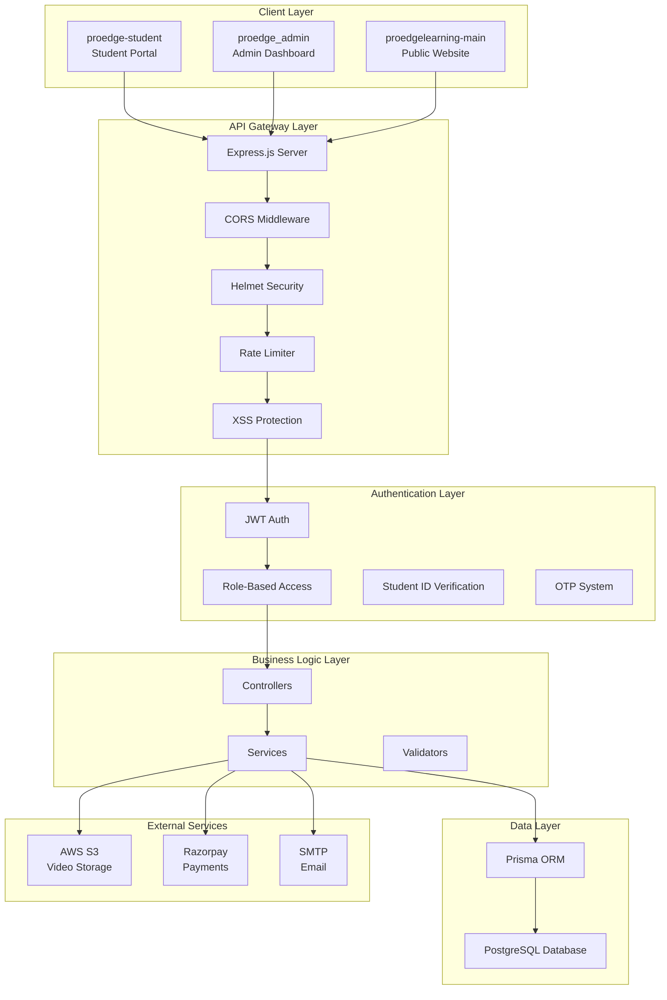

---

## 📊 Database Schema (13 Models)

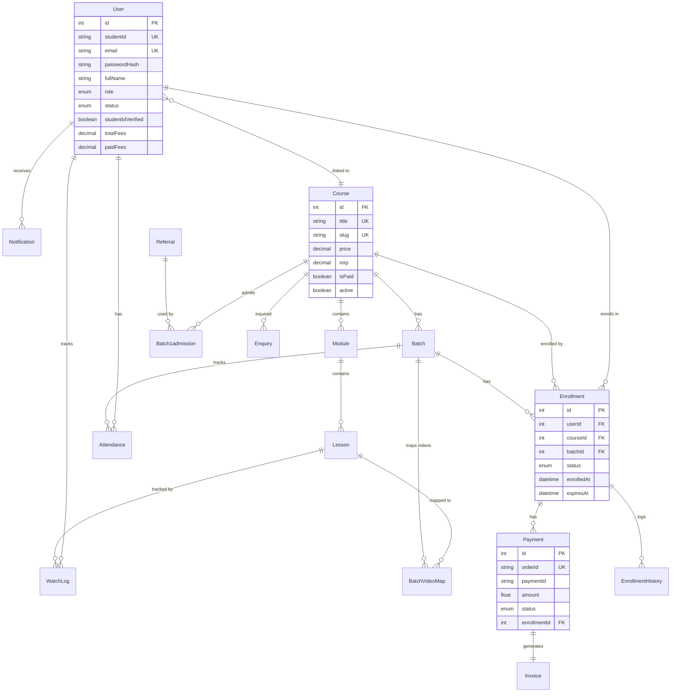

---

## 🔐 Authentication Flow

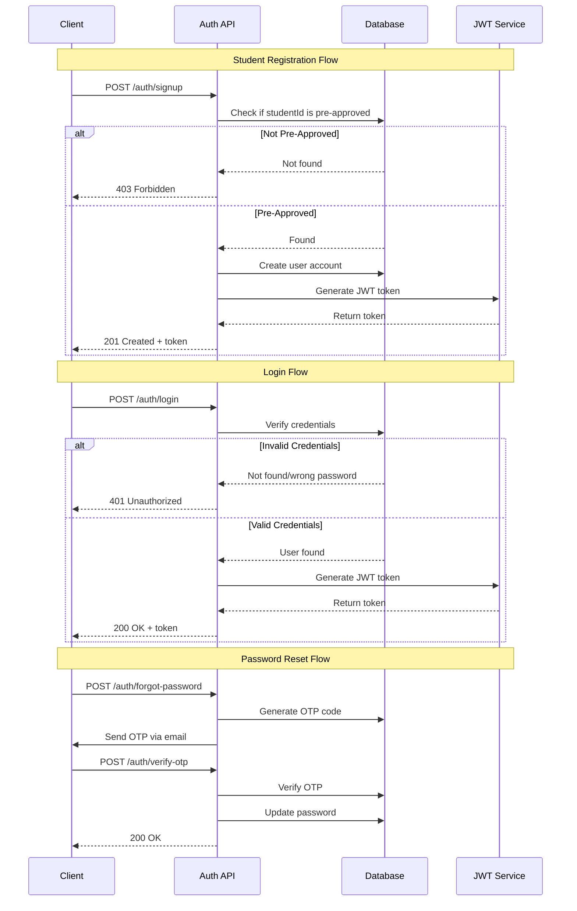

---

## 🎯 Core User Flows

### 1. Student Enrollment Journey

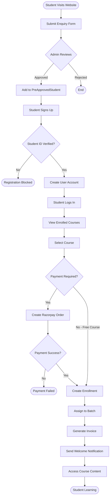

### 2. Video Learning & Attendance Flow

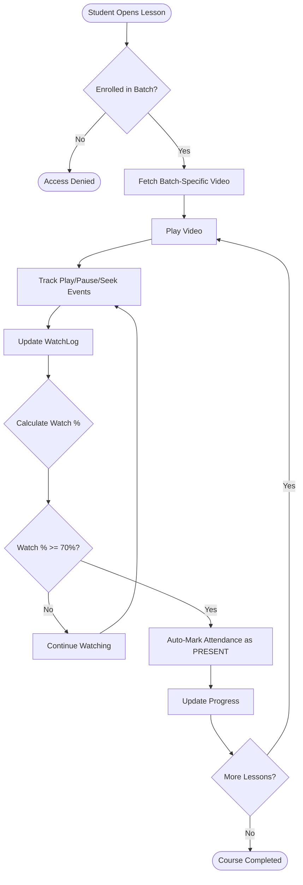

### 3. Admin Student Management Flow

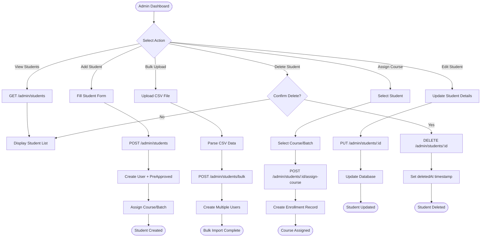

---

## 🛣️ API Routes Structure

### Public Routes (No Auth Required)

| Endpoint | Method | Purpose |
|----------|--------|---------|
| `/courses` | GET | List all active courses |
| `/courses/:slug` | GET | Get course details by slug |
| `/auth/login` | POST | User login |
| `/auth/signup` | POST | Student registration |
| `/auth/forgot-password` | POST | Request password reset |
| `/auth/verify-otp` | POST | Verify OTP and reset password |
| `/enquiries` | POST | Submit enquiry form |
| `/api/students/referrals` | GET | Get referral stats |
| `/payments/webhook` | POST | Razorpay payment webhook |

### Student Routes (Requires STUDENT Role)

| Endpoint | Method | Purpose |
|----------|--------|---------|
| `/student/courses` | GET | Get enrolled courses |
| `/student/courses/:courseId/modules` | GET | Get course modules |
| `/student/courses/:courseId/lessons` | GET | Get all lessons |
| `/student/lessons/:lessonId` | GET | Get lesson details + video URL |
| `/student/progress` | GET | Get learning progress |
| `/enrollments/:enrollmentId/watch-logs` | POST | Update watch progress |
| `/notifications` | GET | Get student notifications |
| `/users/profile` | GET | Get student profile |

### Admin Routes (Requires ADMIN Role)

| Endpoint | Method | Purpose |
|----------|--------|---------|
| `/admin/students` | GET | List all students |
| `/admin/students` | POST | Create new student |
| `/admin/students/bulk` | POST | Bulk upload students (CSV) |
| `/admin/students/:id` | GET | Get student details |
| `/admin/students/:id` | PUT | Update student |
| `/admin/students/:id` | DELETE | Soft delete student |
| `/admin/students/:id/assign-course` | POST | Assign course to student |
| `/admin/students/:id/assign-batch` | POST | Assign batch to student |
| `/admin/courses` | GET/POST/PUT/DELETE | Course CRUD |
| `/lms/modules` | GET/POST/PUT/DELETE | Module CRUD |
| `/lms/lessons` | GET/POST/PUT/DELETE | Lesson CRUD |
| `/lms/batches` | GET/POST/PUT/DELETE | Batch CRUD |
| `/admin/attendance` | GET/POST/PUT | Attendance management |
| `/admin/stats/overview` | GET | Dashboard statistics |
| `/notifications/send` | POST | Send notifications |

### Tutor Routes (Requires TUTOR Role)

| Endpoint | Method | Purpose |
|----------|--------|---------|
| `/lms/batches/my-batches` | GET | Get assigned batches |
| `/lms/batches/:id/students` | GET | List students in batch |
| `/admin/attendance` | POST | Mark attendance |

---

## 💳 Payment Integration Flow

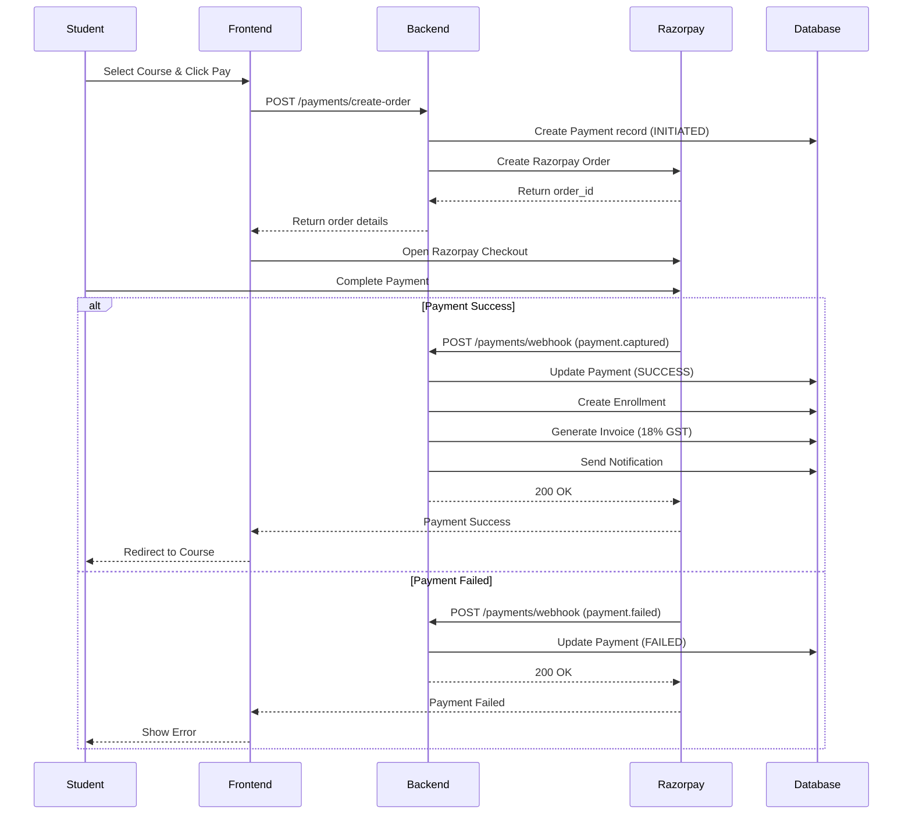

---

## 📹 Video Delivery Architecture

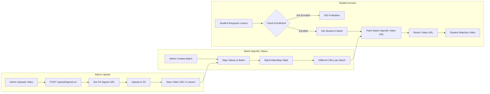

---

## 🔔 Notification System

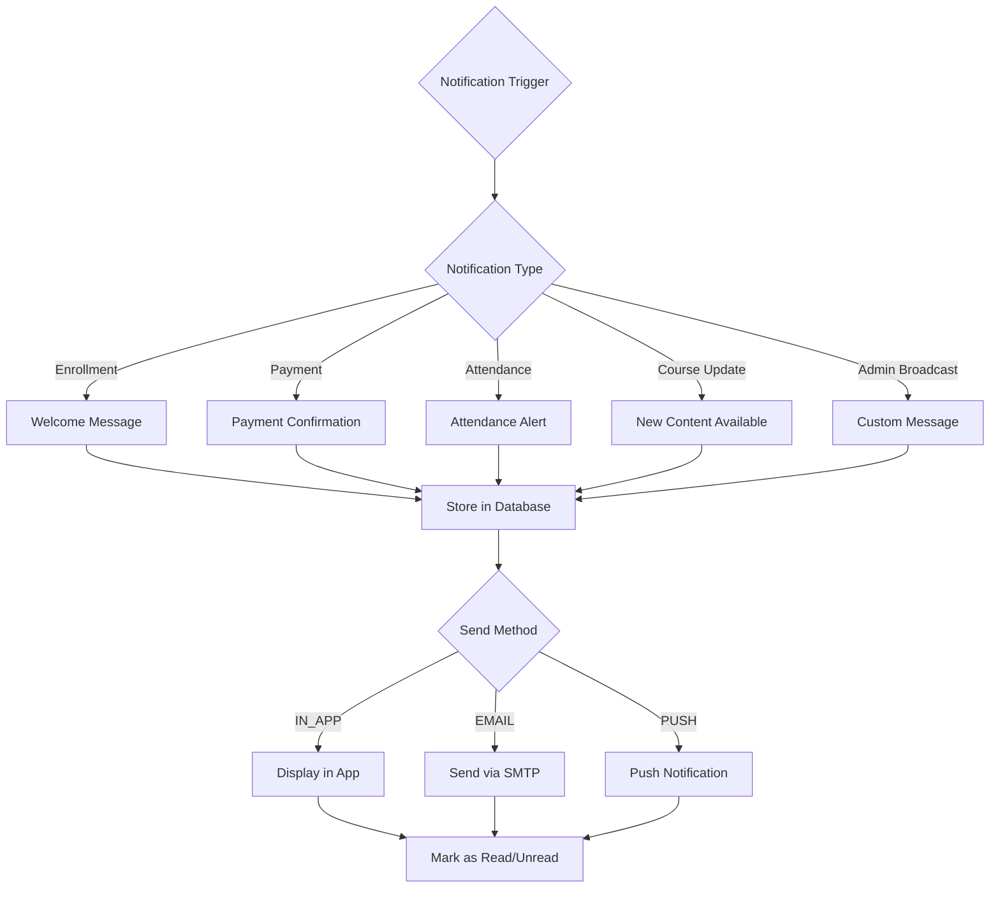

---

## 🎓 Complete Student Learning Flow

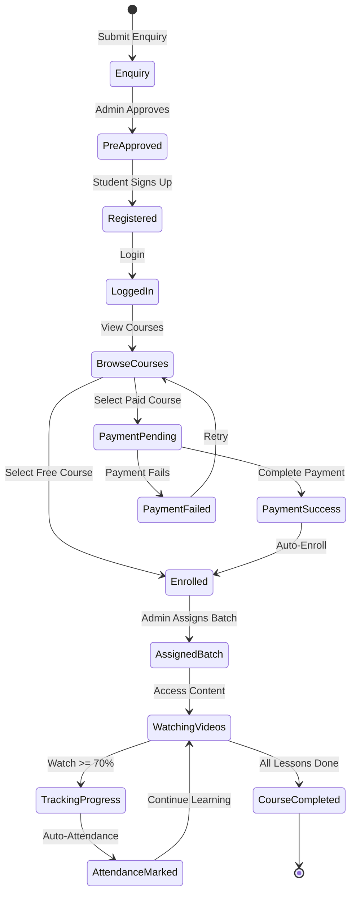

---

## 🔧 Key Features Implementation

### 1. Auto-Attendance System
- Tracks video watch percentage via `WatchLog` table
- Automatically marks attendance as PRESENT when watch % >= 70%
- Stores watch events (play, pause, seek) in JSON format
- Admin can override attendance with notes

### 2. Batch-Specific Video Delivery
- Same lesson can have different videos for different batches
- `BatchVideoMap` table maps `batchId + lessonId → videoUrl`
- Students only see videos for their assigned batch
- Enables personalized content delivery

### 3. Payment Automation
- Razorpay integration with webhook support
- Auto-enrollment on successful payment
- Invoice generation with 18% GST
- Payment status tracking (INITIATED → SUCCESS/FAILED)

### 4. Role-Based Access Control (RBAC)
- **ADMIN**: Full system access, student management, course creation
- **TUTOR**: Batch management, attendance marking, student progress
- **STUDENT**: Course access, video watching, profile management

### 5. Security Features
- JWT authentication with 7-day expiry
- Rate limiting (100 req/15min for API, 5 req/15min for auth)
- XSS protection and input sanitization
- Helmet security headers
- CORS configuration
- Password hashing with bcrypt

---

## 📈 Admin Dashboard Statistics

The `/admin/stats/overview` endpoint provides:

```javascript
{
  totalStudents: 150,
  activeEnrollments: 120,
  totalRevenue: 450000,
  pendingPayments: 25000,
  coursesCount: 12,
  batchesCount: 8,
  todayAttendance: 85,
  recentEnrollments: [...],
  topCourses: [...]
}
```

---

## 🗄️ Database Relationships Summary

| Parent | Child | Relationship | Purpose |
|--------|-------|--------------|---------|
| User | Enrollment | One-to-Many | Student enrolls in multiple courses |
| User | Attendance | One-to-Many | Student has multiple attendance records |
| User | WatchLog | One-to-Many | Student watches multiple lessons |
| Course | Module | One-to-Many | Course contains multiple modules |
| Module | Lesson | One-to-Many | Module contains multiple lessons |
| Course | Batch | One-to-Many | Course has multiple batches |
| Batch | Enrollment | One-to-Many | Batch has multiple students |
| Enrollment | Payment | One-to-Many | Enrollment can have multiple payments |
| Payment | Invoice | One-to-One | Each payment generates one invoice |
| Lesson | BatchVideoMap | One-to-Many | Lesson has different videos per batch |

---

## 🚀 Deployment Architecture

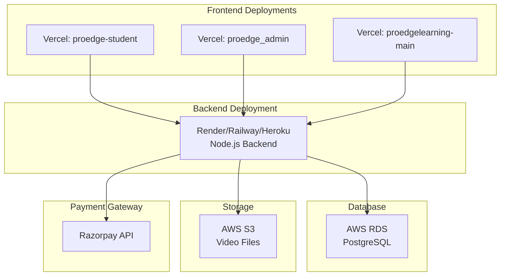

---

## 📝 Environment Variables Required

### Backend (.env)
```env
NODE_ENV=production
PORT=3000
DATABASE_URL=postgresql://...
JWT_SECRET=your-secret-key
JWT_EXPIRES_IN=7d
AWS_ACCESS_KEY_ID=...
AWS_SECRET_ACCESS_KEY=...
AWS_REGION=ap-south-1
S3_BUCKET_NAME=...
RAZORPAY_KEY_ID=...
RAZORPAY_KEY_SECRET=...
SMTP_HOST=smtp.gmail.com
SMTP_PORT=587
SMTP_USER=...
SMTP_PASS=...
ALLOWED_ORIGINS=https://your-frontend.vercel.app
```

### Frontend (.env.production)
```env
VITE_API_BASE_URL=https://your-backend.onrender.com
```

---

## 🎯 Summary

The ProEdge LMS backend is a production-ready system with:
- ✅ **13 Database Models** for comprehensive data management
- ✅ **65+ API Endpoints** covering all LMS functionality
- ✅ **3 User Roles** (Admin, Tutor, Student) with RBAC
- ✅ **Automated Attendance** based on video watch percentage
- ✅ **Payment Integration** with Razorpay and auto-enrollment
- ✅ **Batch-Specific Content** delivery for personalized learning
- ✅ **Security Features** including JWT, rate limiting, XSS protection
- ✅ **Notification System** for in-app, email, and push notifications
- ✅ **Swagger Documentation** at `/api-docs`

This architecture supports scalable, secure, and feature-rich online learning platform operations.
